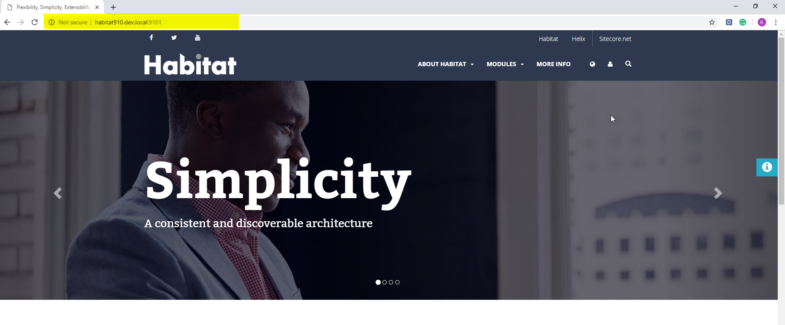
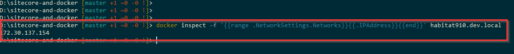
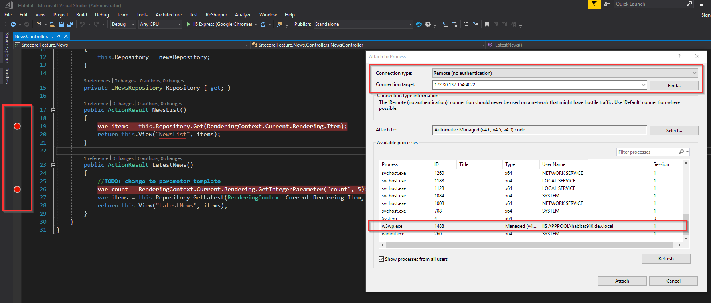
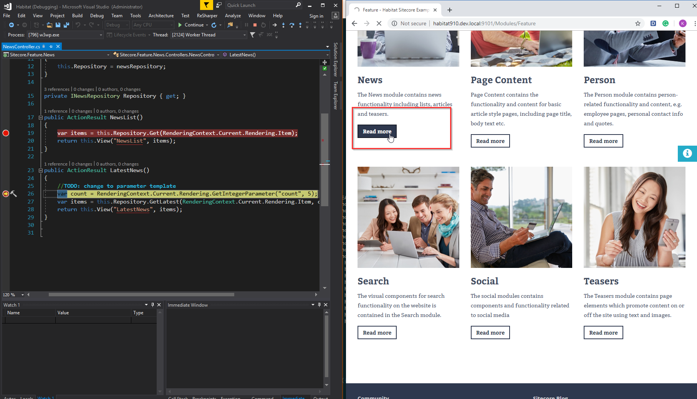

# Deploy Sitecore 9.1.x to Docker

## Prerequisites

- Windows 10 Pro Version 1809
- [Docker for Windows](https://hub.docker.com/editions/community/docker-ce-desktop-windows)
  - Switch to Windows Container

## Preparations

1. Suppose this repo is cloned on our local at - `D:\sitecore-and-docker`
1. Download the following tools then put into `Assets` folder
   - [java-1.8.0-openjdk-1.8.0.161-1.b14.ojdkbuild.windows.x86_64.zip](https://github.com/ojdkbuild/ojdkbuild/releases/download/1.8.0.161-1/java-1.8.0-openjdk-1.8.0.161-1.b14.ojdkbuild.windows.x86_64.zip)
   - [solr-7.2.1.zip](http://archive.apache.org/dist/lucene/solr/7.2.1/solr-7.2.1.zip)
   - [SQLServer2017-DEV-x64-ENU.exe](https://go.microsoft.com/fwlink/?linkid=840945)
   - [SQLServer2017-DEV-x64-ENU.box](https://go.microsoft.com/fwlink/?linkid=840944)
   - [WebDeploy_amd64_en-US.msi](https://download.microsoft.com/download/0/1/D/01DC28EA-638C-4A22-A57B-4CEF97755C6C/WebDeploy_amd64_en-US.msi)
   - [rewrite_amd64_en-US.msi](https://download.microsoft.com/download/1/2/8/128E2E22-C1B9-44A4-BE2A-5859ED1D4592/rewrite_amd64_en-US.msi)
   - [VC_redist.x64.exe](https://aka.ms/vs/15/release/VC_redist.x64.exe)
   - [dotnet-hosting-2.1.3-win.exe](https://dotnet.microsoft.com/download/thank-you/dotnet-runtime-2.1.9-windows-hosting-bundle-installer)
   - [vs_remotetool.exe](https://aka.ms/vs/15/release/RemoteTools.amd64ret.enu.exe)
   - [Sitecore 9.1.0 rev. 001564 (WDP XP0 packages).zip](https://dev.sitecore.net)
   - [Sitecore 9.1.1 rev. 002459 (WDP XP0 packages).zip](https://dev.sitecore.net)
1. Also, put our Sitecore license - **license.xml** into `Assets` folder

## Build Images Base

```powershell
Set-Location -Path "D:\sitecore-and-docker\ImagesBase"
```

```powershell
.\docker.ps1
```

## Parameters Explaination

In the following PowerShell's script for building docker's images and starting docker's container, there are some parameters that we need to pay attention

   - **-SitecorePrefix**: it's a prefix of a site; e.g. `habitat910` or `habitat911`
   - **-SitecoreVersion**: the version of Sitecore that we want to have. Currently, it accepts 2 values which are: `9.1.0` and `9.1.1`
   - **-PortInit**: The port of Sitecore's site and its relative will be initialized from this value. Rules for generating ports for others host is -
     - Main site = `PortInit + 1`
     - Identity Server site = `PortInit + 2`
     - xConnect site = `PortInit + 3`
     - Solr = `PortInit + 4`
     - SqlServer = `PortInit + 5`
   - **-Build**: execute the docker-compose build
   - **-Start**: execute the docker-compose up
   - **-Init**: (re)create folders that will be used to bind to docker's volumes

## Build Images then Start Containers

1. We'll build the images for **Sitecore 9.1.0** as an example. Therefore, the parameters will be

   - **-SitecorePrefix**: habitat910
   - **-SitecoreVersion**: 9.1.0
   - **-PortInit**: 9100

1. After starting docker's container, we can touch the following host as below

   - Main site: `http://habitat910.dev.local:9101`
   - Identity Server site: `https://habitat910_identityserver.dev.local:9102`
   - Solr Server: `https://habitat910_solr:9104`
   - SqlServer (use Management Studio): `habitat910_sqlserver, 9105`

### Build Sitecore's images

1. Here are the list of docker's images for Sitecore and its relative

    - Solr
    - SqlServer
    - Website
    - Identity Server
    - xConnect
    - xConnect_AutomationEngine
    - xConnect_IndexWorker
    - xConnect_ProcessingEngine

2. Open the `docker.ps1` script then modify the corresponding values

    ```powershell
    $MainFolder = "E:/SitecoreDocker"       # this folder will be used to create the set of sub-folders to bind to docker's volumes
    $SolutionFolder = "D:\forks\Habitat"    # where the [Habitat](https://github.com/Sitecore/Habitat) cloned
    ```

3. Open **PowerShell** as **Administrator**; then change the working directory to main folder of cloned repository (i.e. `D:\sitecore-and-docker`)

    ```powershell
    Set-Location -Path "D:\sitecore-and-docker"
    ```

4. Execute the `docker.ps1` script as below

    ```powershell
    .\docker.ps1 -SitecorePrefix habitat910 -SitecoreVersion 9.1.0 -PortInit 9100 -Build
    ```

### Starting Docker Containers

1. Start at **first** time or reset to blank instance

    ```powershell
    .\docker.ps1 -SitecorePrefix [sc-prefix] -SitecoreVersion [sc-version] -PortInit [port] -Start -Init
    ```

2. Start from **second** time and do not need to re-create folders for binding to docker's volumnes

    ```powershell
    .\docker.ps1 -SitecorePrefix [sc-prefix] -SitecoreVersion [sc-version] -PortInit [port] -Start
    ```

## Run the Sitecore's site

1. Import the following certicates from `D:\sitecore-and-docker\Sitecore\xp_base\Certificates` within the password **PoqNCUErvc**

    - `habitat910_identityserver.dev.local.pfx`
    - `habitat910_solr.pfx`

1. Add the following host names into `C:\Windows\System32\drivers\etc\hosts` file

    ```text
    127.0.0.1   habitat910.dev.local
    127.0.0.1   habitat910_identityserver.dev.local
    127.0.0.1   habitat910_solr
    127.0.0.1   habitat910_sqlserver
   ```

1. Open the browser then access the Url - `http://habitat910.dev.local:9101`. It will redirect to `https://habitat910_identityserver.dev.local:9102`

1. Use the Sitecore's admin - **admin/b** to login

1. Go to `Control Panel` to **Populate Solr Managed Schema**; then Re-indexing all Solr's cores

## How to build images and start containers for Sitecore 9.1.1

1. Repeat the above steps with the following parameters's values (in order to distinguide with existing instances of Sitecore 9.1.0)
   - **-SitecorePrefix**: habitat911
   - **-SitecoreVersion**: 9.1.1
   - **-PortInit**: 9110

2. Import Certificates from `D:\sitecore-and-docker\Sitecore\xp_base\Certificates` within the password **PoqNCUErvc**

   - `habitat910_identityserver.dev.local.pfx`
   - `habitat910_solr.pfx`

3. Add the following host names into `C:\Windows\System32\drivers\etc\hosts` file

    ```text
    127.0.0.1   habitat911.dev.local
    127.0.0.1   habitat911_identityserver.dev.local
    127.0.0.1   habitat911_solr
    127.0.0.1   habitat911_sqlserver
   ```

4. After starting docker's container, we can touch the following host as below

    - Main site: `http://habitat911.dev.local:9111`
    - Identity Server site: `https://habitat911_identityserver.dev.local:9112`
    - Solr Server: `https://habitat911_solr:9114`
    - SqlServer (use Management Studio): `habitat911_sqlserver, 9115`

5. Open the browser then access the Url - `http://habitat911.dev.local:9111`. It will redirect to `https://habitat911_identityserver.dev.local:9112`

6. Login with **admin/b**; then **Populate Solr Managed Schema** and re-index all Solr's cores

## Bonus points

### How to view the logs

- Under `E:\SitecoreDocker-9.1.0` for example (it can be `E:\SitecoreDocker-9.1.1` if we install Sitecore 9.1.1), there are some sub folders that will be explained below
  - `habitat910_IdentityServerLogs`: logs of Identity Server
  - `habitat910_SitecoreSite`: act as webroot; we can find the log files under `habitat910_SitecoreSite\App_Data\logs`
  - `habitat910_Solr`: act as data folder of Solr server, it stores all Solr's cores
  - `habitat910_SqlServer`: act as data folder of SqlServer, we can find all of **.mdf** and **.ldf** files in here
  - `habitat910_xConnect`: where the logs of `x_connect` are written
  - `habitat910_xConnect_AutomationEngine`: where the logs of `x_connect_automationengine` are written
  - `habitat910_xConnect_IndexWorker`: where the logs of `x_connect_indexworker` are written
  - `habitat910_xConnect_ProcessingEngine`: where the logs of `x_connect_processingengine` are written

### Deploy Habitat into `habitat910.dev.local` (since Habitat hasn't been updated to Sitecore 9.1.1 at this time)

1. Suppose the habitat source code is cloned to local at `D:\forks\Habitat` for example (please note that this folder has been modified in `docker.ps1` when build Sitecore's images)

2. Before starting deploy `Habitat`, we have to modify some configuration values to work with docker's environment.

    1. Modify `gulp-config.js`

        ```javascript
        var instanceRoot = "E:\\SitecoreDocker-9.1.0\\habitat910_SitecoreSite";
        ```

        **Notes:**
        - `E:\Sitecore-Docker-9.1.0\habitat910_SitecoreSite` - which is the webroot folder of `habitat910.dev.local`

    2. Modify `\src\Project\Habitat\code\App_Config\Environment\Project.Habitat.Dev.config`

        ```xml
        <sc.variable name="sourceFolder" value="C:\UnicornSource" />
        ```

        **Notes:**
        - `C:\UnicornSource` - is the folder in `habitat910.dev.local`; it's bound to `D:\fork\Habitat` which is our local folder that used to clone `Habitat` repository

    3. Modify `\src\Project\Habitat\code\App_Config\Include\Project\Habitat.Website.config`

        ```xml
        <site name="habitat" patch:after="site[@name='modules_website']"
                  targetHostName="habitat910.$(rootHostName)"

            <!--- Rest of config ---->

        </site>
        ```

    4. Modify `publishsettings.targets`

        ```xml
        <publishUrl>http://habitat910.dev.local:9101</publishUrl>
        ```

3. Start deploying as normal by [this guide](https://github.com/Sitecore/Habitat/wiki/01-Getting-Started#2-build-and-deploy-habitat)

### How to debug Habitat that run on Docker?

1. The image of `habitat910.dev.local` has already installed remote debugging tool - **vs_remotetools.exe**. Therefore, we just need to run this tool

    ```powershell
    docker exec -itd habitat910.dev.local Enable-Remote-Debug.cmd
    ```

2. Get **IP** of `habitat910.dev.local` by using the following command (i.e. 172.30.137.154)

    ```powershell
    docker inspect -f '{{range .NetworkSettings.Networks}}{{.IPAddress}}{{end}}' habitat910.dev.local
    ```

3. Open `Habitat.sln` by **Visual Studio 2017** as **Administrator**; set debug point to anywhere (i.e. `Feature\News\Controller\NewsController`)

4. From the Menu of Visual Studio; **Debug** > **Attach to Process**
    - **_Connection Type:_** Remote (no authentication)
    - **_Connection Target:_** 172.30.137.154:4022

5. Select `w3wp.exe` process then start to debug

## Screenshots

1. Habitat on Docker

    

2. Get the IP of `habitat910.dev.local` container

    

3. Attach process to debug Habitat

    

4. Debugging Habitat

    

## Known Issues

1. Some docker's container might be not start correctly, they are:

    - From `habitatx_xconnect_indexworker`: cannot connect to solr server `172.30.140.25:8983`

        ```text
        [Error] Failed indexing next set of changes. There will be an attempt to recover from the failure.
        System.Net.Http.HttpRequestException: An error occurred while sending the request. ---> System.Net.WebException: Unable to connect to the remote server ---> System.Net.Sockets.SocketException: A connection attempt failed because the connected party did not properly respond after a period of time, or established connection failed because connected host has failed to respond 172.30.140.25:8983
        ```

    - From `habitat91x_xconnect_processingengine`: cannot open the database `habitat910_ProcessingEngineTasks`

        ```text
        [Error] Error Picking Processing Task, Message: Cannot open database "habitat910_ProcessingEngineTasks" requested by the login. The login failed.
        Login failed for user 'sa'.
        System.Data.SqlClient.SqlException (0x80131904): Cannot open database "habitat910_ProcessingEngineTasks" requested by the login. The login failed.
        Login failed for user 'sa'.
        ```

It might be caused since Solr & Sql Server have not been started completedly. Hence it needs to be **stop** and **start** these containers (i.e. `habitat910_xconnect_indexworker`, `habitat910_xconnect_processingengine`).

```powershell
docker stop habitat910_xconnect_indexworker habitat910_xconnect_processingengine
```

```powershell
docker start habitat910_xconnect_indexworker habitat910_xconnect_processingengine
```

## Resources

- I'm inspired by the repository - [Repository of Sitecore Docker base images](https://github.com/sitecoreops/sitecore-images)
- [USING THE PKCS #12 (.PFX) FORMAT FOR SOLR SSL SECURITY](https://blogs.perficientdigital.com/2018/08/20/using-the-pkcs12-pfx-format-for-solr-ssl-security/)
- [Microsoft/dotnet-framework-docker](https://github.com/Microsoft/dotnet-framework-docker/blob/master/4.7.2/runtime/windowsservercore-ltsc2019/Dockerfile)
- [Microsoft/aspnet-docker](https://github.com/Microsoft/aspnet-docker/blob/master/4.7.2-windowsservercore-1709/runtime/Dockerfile)
- [Debugging Windows containers with Visual Studio](https://medium.com/@marco.fiocco/debugging-windows-containers-with-visual-studio-yes-also-c-apps-740f6e1965b8)